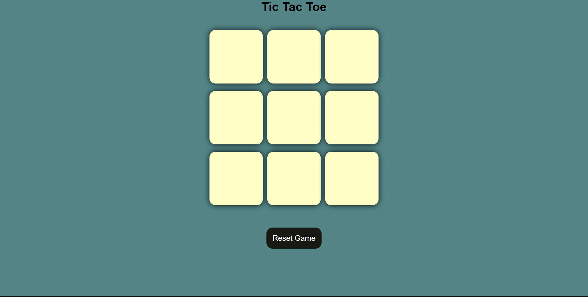

# 🎮 Tic Tac Toe - Web Game

A simple and interactive Tic Tac Toe game built using HTML, CSS, and JavaScript. This game allows two players to take turns and compete in a classic 3x3 grid, with instant feedback on win, draw, and reset.

---

## 🌟 Features

- Classic 3x3 Tic Tac Toe logic
- Two-player game mode
- Game win/draw detection
- Reset and new game functionality
- Fully responsive and visually appealing UI

---

## 📸 Screenshot



---

## 🛠️ Built With

- **HTML** – Structure
- **CSS** – Styling and layout
- **JavaScript** – Game logic and interactivity

---

## 🚀 How to Run the Game

1. Clone the repository:
   ```bash
   git clone https://github.com/your-username/tictactoe-js-game.git
   cd tictactoe-js-game
